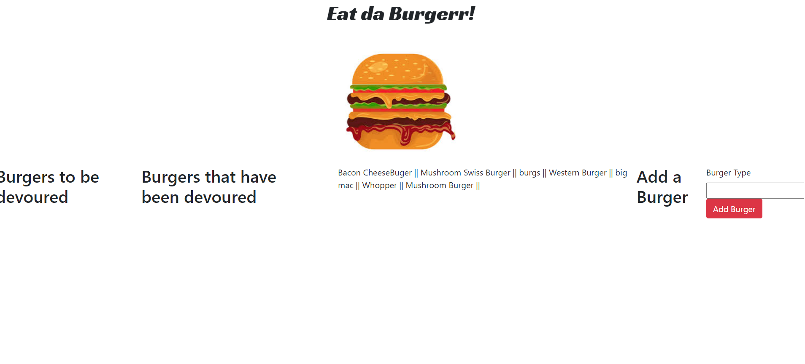

# Eat-Da-Burger Application

## About
For this Project we were tasked with building an application that would allow a user to make a burger, and choose to eat it! 

## Links

[GithubRepo](https://github.com/Nickcostanza/my-burger-app)
 
[Youtube Video](https://youtu.be/aazclyoP0GA)

App is functioning, was having trouble with deployment, so there is a video link to my youtube video for viewing of functionality.
Css styling is still needed on this application.

# License
